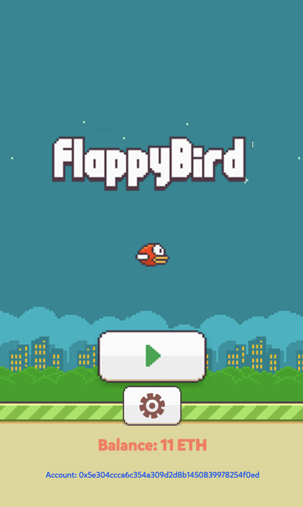
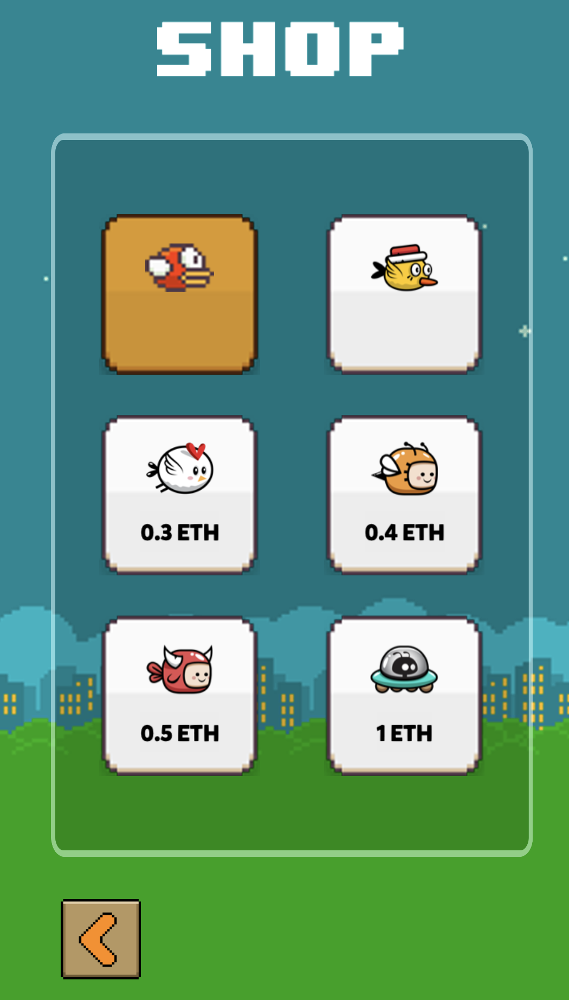

# Etherbird

## Introduction

This is a Flappy bird style game - run on Ethereum - built by Cocos Creator.

Live Game: [PLAY](https://etherbird.surge.sh)

(Make sure you are using Rinkeby and have some Ether in your account)

## How to play

- Hit `PLAY` to start a new game.



- You also can buy and use new birds in shop



- If you reach 10 score, you will receive `0.01 ETH`
- If you reach from 30 score, you will receive `0.05 ETH`


## How it works

- Game Client: Cocos creator
- Blockchain: Ethereum
- Smart Contract: Truffle
- Game-Blockchain Connection: Web3js

## How to Build

### Build Smart Contract

- Make sure you have got truffle installed: https://github.com/trufflesuite/truffle/releases
- Go to `/contracts`
- Copy `.env.example` to `.env` and config your keys here:

```sh
cp .env.example .env;
```

- Install dependencies: `yarn install`
- Compile && migrate to network you want (for example `rinkeby`):

```sh
truffle migrate --reset --network rinkeby
```

- now you have built contracts in `/etherbird-game/assets/contracts`

### Build Game

- Install Cocos Creator: https://www.cocos.com/en/creator (this game was built by version 2.1.13, use higher version may lead to lost metadata when open scene).
- Open project, you will see 2 scene: `entrance` and `game`
- All connection beetween game and blockchain was implemented in class `Web3Controller`, in case you want to use your own smart contract, change the `ContractABI` inside the `Web3Controller` component.
- Select `Browser` and run it.
- If you want to publish anywhere on internet, built it and deploy on your server. References here: https://docs.cocos2d-x.org/creator/manual/en/publish/publish-web.html

## Known issues and Future development

- Due to short development duration, of course we made some bugs!
- Because we have many asynchronous actions, sometime it will not update page when transaction is completed or when switch network.
- In future, we will solve all bugs, and support more chain like Mainchain, Ropsten, Kovan, Loom, Tomochain....

_Enjoy Coding_

**_Do Trung Kien_**
